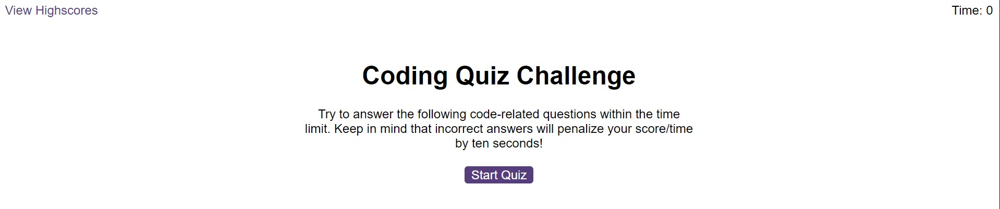
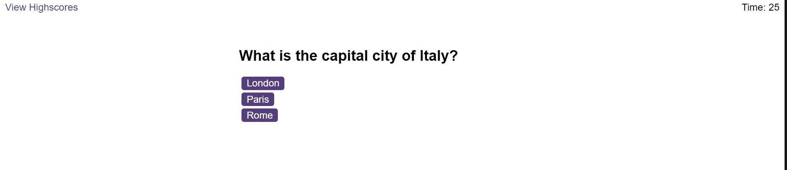
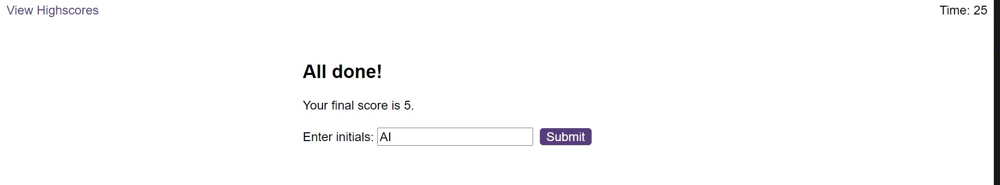

# Code-Quiz
A multiple-choice quiz

## Description

This is a capital city quiz. The answers are centralized at the end of the quiz.

## Instalation

The website page can be accessed [here](https://ionescuea.github.io/Code-Quiz/).

## Usage

On the main page, the user will find the 'Start Quiz' button. By clicking the button the quiz will start. There is a time limit of 30 seconds to respond the maximum of 5 questions.

If the answer is correct, the next question will appear.
If the answer is wrong, the time will decrease by 10 seconds and the quiz will move to the next question.
The correct answers are added (1 point for each correct answer) and the result displayed at the end.

At the end of the quiz, the user will be asked to put their initials in order to save their score, by pressing 'Submit'.

Also, there is a Highscores page that will centralise all the scores. The scores can be deleted if pressing 'Clear Highscores' button. Moreover, the user can return to the main page by clicking 'Go back'.

## Credits

[BootcampSpot](https://github.com/edx)

[Alexandra Ionescu](https://github.com/ionescuea)

## License

Licensed under the [MIT](LICENSE) license.